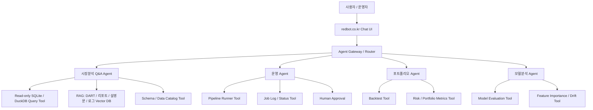

# redbot.co.kr Agent 구성 제안

## 배경

redbot.co.kr은 주식시장 분석 사이트이며, SQLite DB 기반으로 2014년 이후의 거래 데이터, DART 자료, 미국 경제 데이터, 야후 해외 경제 데이터 등을 수집하고 있습니다. 또한 데이터 수집, 분석, AI 학습 모델, 모델 파이프라인 실행, 포트폴리오 분석 등 복잡한 작업들이 순서대로 실행되는 구조입니다.

이 환경에서는 단순히 챗봇을 붙이는 방식보다, 기존 데이터와 파이프라인을 안전하게 호출할 수 있는 Agent 구조가 적합합니다. 핵심은 LLM에게 모든 권한을 직접 주는 것이 아니라, 검증된 도구를 제한적으로 호출하게 만드는 것입니다.

## 추천 아키텍처



## 핵심 결론

redbot에는 하이브리드 Agent 구조가 가장 적합합니다.

1. 정형 데이터는 SQL로 조회합니다.
   거래 데이터, 가격, 재무지표, 경제지표처럼 테이블 구조가 있는 데이터는 LLM이 직접 생성해서 답하면 안 됩니다. LLM은 질문을 해석하고, 실제 숫자는 `read_only_sql_query()` 같은 도구가 조회해야 합니다.

2. 비정형 문서는 RAG로 검색합니다.
   DART 공시 원문, 리포트, 뉴스 요약, 모델 설명서, 파이프라인 로그, 전략 문서 등은 벡터 검색과 RAG가 적합합니다.

3. 복잡한 작업 순서는 상태 기반 Agent로 관리합니다.
   이미 `데이터 수집 -> 분석 -> 모델 실행 -> 성능평가 -> 포트폴리오 분석`처럼 순서가 있는 작업이 있으므로, 단순 function calling보다 상태 저장, 재시작, human-in-the-loop이 가능한 구조가 유리합니다.

4. 외부 연결은 MCP 또는 Tool API로 분리합니다.
   나중에 ChatGPT, Claude, 내부 앱, Codex 등 여러 환경에서 redbot 도구를 재사용하려면 MCP 서버나 독립 Tool API로 `시장데이터조회`, `백테스트실행`, `파이프라인상태확인` 같은 기능을 노출하는 방식이 좋습니다.

## Agent 분리안

| Agent | 역할 | 허용 도구 |
| --- | --- | --- |
| `MarketQAAgent` | 사용자의 시장 분석 질의응답 | 읽기 전용 SQL, RAG, 차트 생성 |
| `DataOpsAgent` | 데이터 수집 상태 확인, 누락 데이터 점검 | 로그 조회, 수집기 실행 요청 |
| `PipelineAgent` | 모델/분석 파이프라인 실행 순서 관리 | Job 실행, 상태 확인, 실패 재시도 |
| `PortfolioAgent` | 종목군, 리스크, 수익률, 리밸런싱 분석 | 백테스트, 포트폴리오 지표 계산 |
| `ModelEvalAgent` | AI 모델 성능 비교, feature drift, 예측 성능 점검 | 모델 평가, 실험 결과 조회 |
| `SupervisorAgent` | 질문 분류, 적절한 Agent 선택 | 위 Agent들에게 위임 |

## 운영 명령과 질의응답 분리

운영 명령과 일반 질의응답은 반드시 분리해야 합니다.

예를 들어 다음 질문은 바로 답변해도 됩니다.

```text
삼성전자 최근 3년 실적을 요약해줘.
```

하지만 다음 명령은 승인 단계가 필요합니다.

```text
오늘 전체 파이프라인을 다시 돌려줘.
```

분석 조회는 읽기 전용으로 실행하고, 데이터 변경, 모델 재학습, 대량 파이프라인 실행, 포트폴리오 변경과 같은 작업은 human-in-the-loop 승인 단계를 거쳐야 합니다.

## SQLite 사용 전략

현재 10GB 이상 SQLite DB를 사용하고 있다면 초기 Agent 연동은 그대로 진행할 수 있습니다. 다만 웹서비스에서 다중 사용자 질의, 장기 쿼리, 동시 읽기/쓰기, 백테스트 부하가 커지면 병목이 생길 수 있습니다.

현실적인 중간 구조는 다음과 같습니다.

| 용도 | 추천 저장소 |
| --- | --- |
| 운영 원본 데이터 | SQLite 유지 |
| 대용량 분석 조회 | DuckDB 또는 Parquet 캐시 |
| 동시 접속/확장 서비스 | PostgreSQL 전환 검토 |
| 문서/리포트 검색 | Chroma, FAISS 등 Vector DB |

## 안전한 Tool 설계

LLM에게 DB 전체 접근 권한을 직접 주면 안 됩니다. 대신 다음과 같은 제한된 도구를 만들어야 합니다.

```python
def inspect_schema(table_name: str) -> dict:
    """허용된 테이블의 컬럼, 타입, 설명을 반환한다."""


def read_only_sql_query(sql: str, max_rows: int = 200) -> dict:
    """SELECT 계열 쿼리만 실행하고 결과를 제한된 행 수로 반환한다."""


def retrieve_documents(query: str, top_k: int = 5) -> list[dict]:
    """DART, 리포트, 전략 문서, 로그에서 관련 문서를 검색한다."""


def run_backtest(strategy_id: str, start_date: str, end_date: str) -> dict:
    """허용된 전략에 대해 백테스트를 실행하고 결과 요약을 반환한다."""


def get_pipeline_status(job_id: str | None = None) -> dict:
    """파이프라인 실행 상태와 최근 실패 원인을 조회한다."""
```

중요한 제한 조건은 다음과 같습니다.

- SQL은 기본적으로 `SELECT`만 허용합니다.
- 쿼리 타임아웃과 최대 반환 행 수를 둡니다.
- 허용 테이블 목록을 둡니다.
- 파이프라인 실행은 승인 전에는 dry-run 또는 계획만 반환합니다.
- 모든 Tool 호출은 로그로 남깁니다.
- 답변에는 사용한 테이블, 기간, 필터, 계산식을 표시합니다.

## 1차 구현 방향

redbot에 처음 붙인다면 다음 순서가 적합합니다.

1. `redbot_agent_api`라는 별도 FastAPI 서비스를 만듭니다.
2. SQLite를 직접 열지 않고 `read_only_query()` 도구로만 접근합니다.
3. DART 문서, 전략 설명, 모델 로그는 Chroma 또는 FAISS로 색인합니다.
4. LangGraph로 `질문분류 -> SQL/RAG/계산 -> 검증 -> 답변` 그래프를 구성합니다.
5. 파이프라인 실행 도구는 처음에는 상태 조회만 허용합니다.
6. 실행, 재학습, 대량 작업은 관리자 승인 후 실행합니다.
7. redbot.co.kr 프론트에는 Chat UI와 분석 결과 테이블/차트를 표시합니다.

## 권장 기술 선택

| 영역 | 추천 |
| --- | --- |
| LLM Agent Runtime | OpenAI Agents SDK 또는 LangGraph |
| 복잡한 장기 실행 워크플로 | LangGraph |
| 간단한 Tool Calling | OpenAI Responses API / Agents SDK |
| DB 조회 | SQLite read-only, DuckDB, SQLAlchemy |
| 문서 검색 | Chroma, FAISS, OpenAI Embeddings |
| API 서버 | FastAPI |
| 프론트 연동 | redbot.co.kr Chat UI |
| 추적/평가 | OpenAI Tracing, LangSmith, 자체 로그 |

## 최종 정리

redbot의 Agent는 다음 방향이 가장 안정적입니다.

> LLM은 판단과 조율 담당, 데이터는 SQL/RAG 도구가 조회, 작업 실행은 승인된 Tool이 수행, 전체 흐름은 LangGraph 또는 Agent Runtime이 관리한다.

이 구조는 복잡한 투자 모델, 데이터 파이프라인, 포트폴리오 분석, 운영 자동화가 함께 있는 서비스에 적합합니다. 특히 투자 관련 답변은 항상 출처, 계산 근거, 사용 데이터 범위를 함께 보여주도록 설계해야 합니다.

## 참고 링크

- [OpenAI Agents SDK](https://openai.github.io/openai-agents-python/)
- [OpenAI Function Calling](https://developers.openai.com/api/docs/guides/function-calling)
- [LangGraph Overview](https://docs.langchain.com/oss/python/langgraph/overview)
- [Model Context Protocol](https://modelcontextprotocol.io/docs/getting-started/intro)
